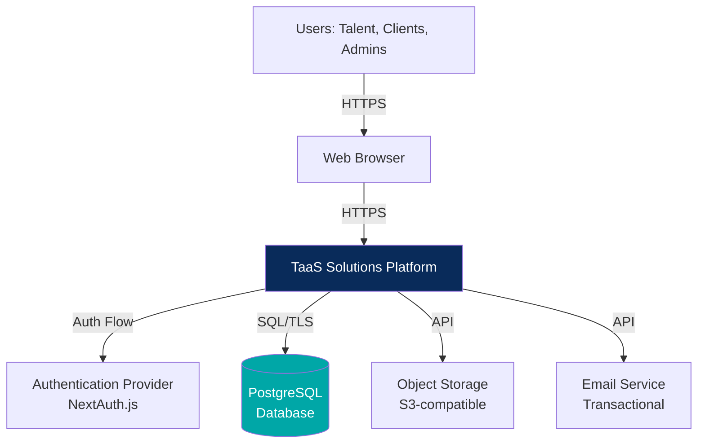
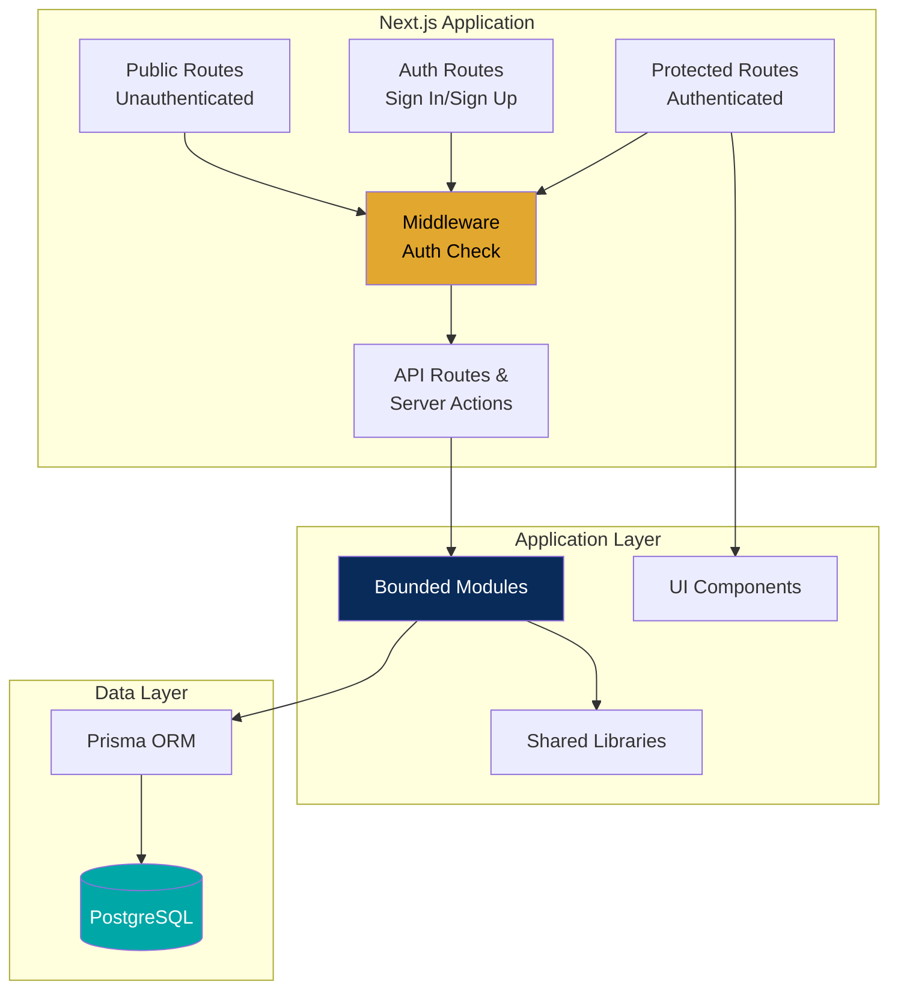
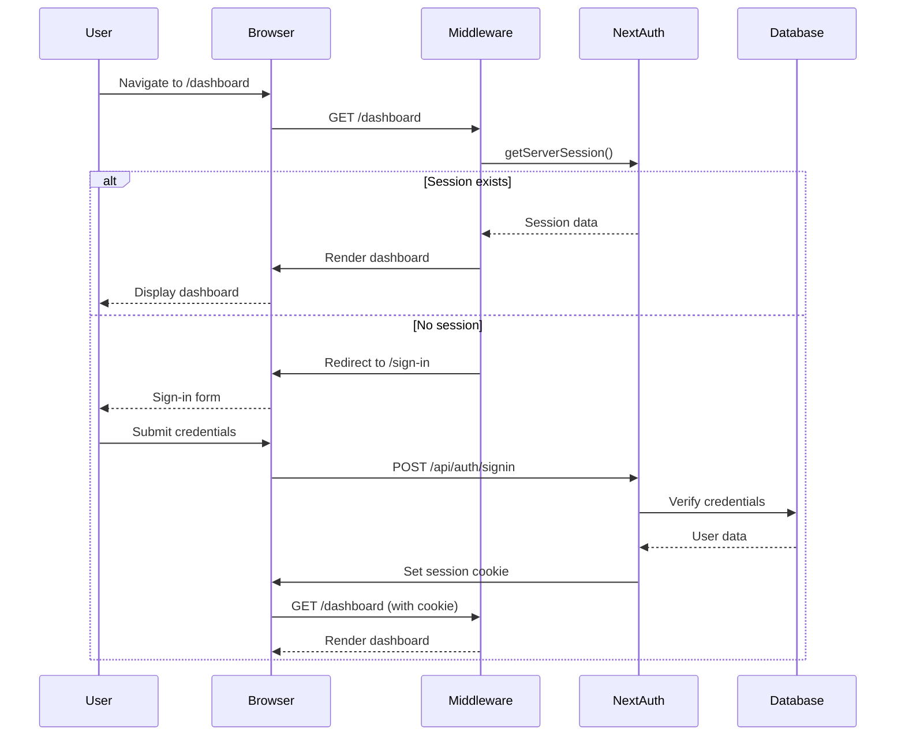
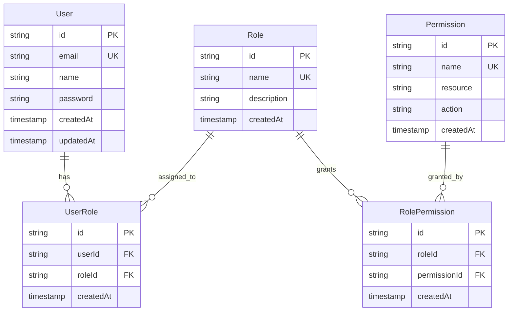
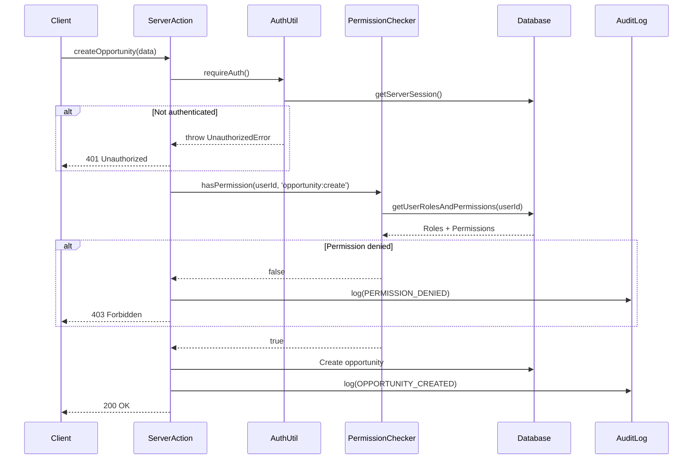
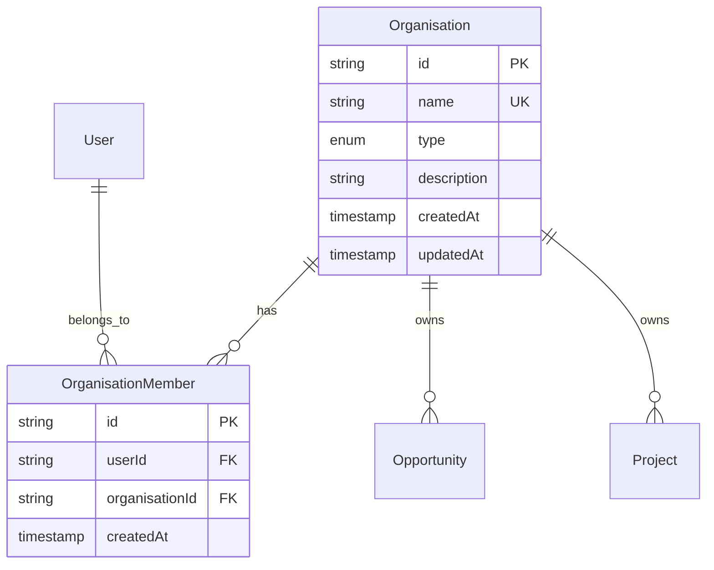
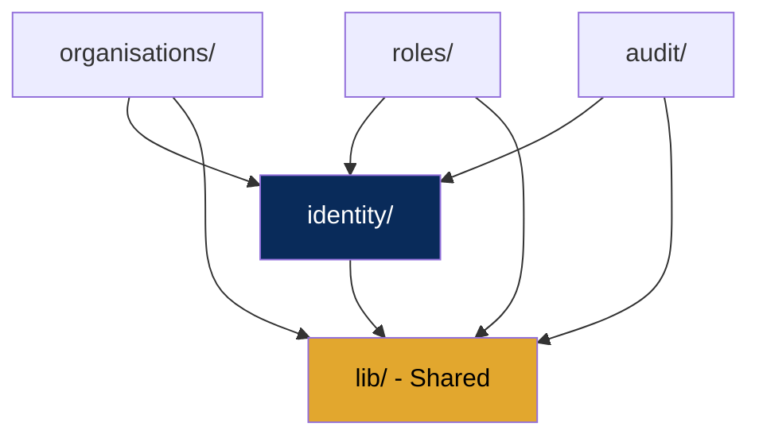
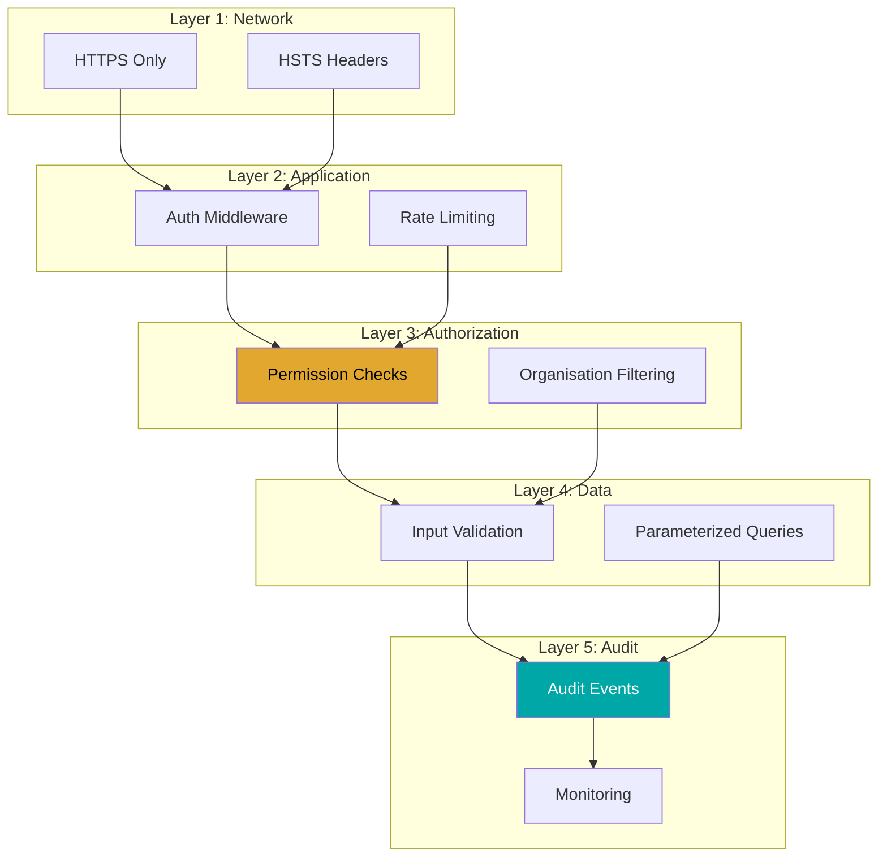
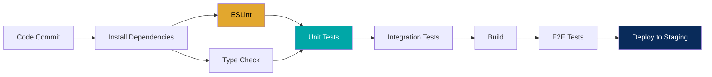

# Platform Foundation Design

## Specification 01: Platform Foundation

**Version:** 1.0  
**Status:** Draft  
**Created:** 2026-09-01  
**Owner:** Platform Architecture Team

---

## 1. Executive Summary

### 1.1 Overview

This document describes the technical design for the TaaS Solutions platform foundation layer, including architecture decisions, data models, security mechanisms, and implementation patterns.

### 1.2 Design Goals

1. **Security-First:** All authorization server-side, audit trail for sensitive actions
2. **Scalable Foundation:** Modular architecture supporting future growth
3. **Developer Experience:** Clear patterns, strong typing, fast feedback
4. **Accessibility:** WCAG 2.1 AA compliance from the start
5. **Maintainability:** Clear module boundaries, comprehensive testing

### 1.3 Technology Stack

- **Frontend:** Next.js 14+ (App Router), React 18+, TypeScript, Tailwind CSS
- **Backend:** Next.js API Routes / Server Actions, Node.js
- **Database:** PostgreSQL 15+, Prisma ORM
- **Authentication:** NextAuth.js (recommendation, configurable)
- **Testing:** Vitest (unit/integration), Playwright (E2E)
- **CI/CD:** GitHub Actions
- **Hosting:** Vercel (recommendation, configurable)

---

## 2. Architecture Overview

### 2.1 Architecture Style

**Decision:** Modular Monolith

**Rationale:**

- Simpler deployment and operations for MVP
- Shared database transactions
- Easier debugging and development
- Can be split into microservices later if growth demands
- Lower infrastructure costs

**Constraints:**

- Clear module boundaries with defined interfaces
- No circular dependencies
- Modules communicate through public APIs only

### 2.2 System Context



### 2.3 Application Architecture



---

## 3. Detailed Design

### 3.1 Authentication Flow



#### 3.1.1 NextAuth.js Configuration

```typescript
// src/lib/auth.ts
import NextAuth, { type NextAuthOptions } from 'next-auth';
import CredentialsProvider from 'next-auth/providers/credentials';
import { PrismaAdapter } from '@next-auth/prisma-adapter';
import { db } from '@/lib/db';
import { verifyPassword } from '@/lib/password';

export const authOptions: NextAuthOptions = {
  adapter: PrismaAdapter(db),
  providers: [
    CredentialsProvider({
      name: 'credentials',
      credentials: {
        email: { label: 'Email', type: 'email' },
        password: { label: 'Password', type: 'password' },
      },
      async authorize(credentials) {
        if (!credentials?.email || !credentials?.password) {
          return null;
        }

        const user = await db.user.findUnique({
          where: { email: credentials.email },
        });

        if (!user || !user.password) {
          return null;
        }

        const isValid = await verifyPassword(credentials.password, user.password);

        if (!isValid) {
          return null;
        }

        return {
          id: user.id,
          email: user.email,
          name: user.name,
        };
      },
    }),
  ],
  session: {
    strategy: 'jwt',
    maxAge: 7 * 24 * 60 * 60, // 7 days
  },
  pages: {
    signIn: '/sign-in',
    signOut: '/sign-out',
    error: '/auth/error',
  },
  callbacks: {
    async jwt({ token, user }) {
      if (user) {
        token.id = user.id;
      }
      return token;
    },
    async session({ session, token }) {
      if (session.user) {
        session.user.id = token.id as string;
      }
      return session;
    },
  },
};

export const getServerSession = () => getServerSession(authOptions);
```

#### 3.1.2 Session Management

**Session Storage:** JWT stored in HTTP-only cookie  
**Session Duration:** 7 days (configurable)  
**Session Refresh:** Automatic via NextAuth.js  
**Session Invalidation:** On logout, password change

**Cookie Configuration:**

```typescript
cookies: {
  sessionToken: {
    name: '__Secure-next-auth.session-token',
    options: {
      httpOnly: true,
      sameSite: 'lax',
      path: '/',
      secure: true, // HTTPS only in production
    },
  },
}
```

### 3.2 Authorization Model

#### 3.2.1 Permission Model



#### 3.2.2 Authorization Flow



#### 3.2.3 Permission Naming Convention

Format: `resource:action`

**Examples:**

- `user:create` - Create users
- `user:read` - View user details
- `user:update` - Update user information
- `user:delete` - Delete users
- `organisation:create` - Create organisations
- `organisation:members:add` - Add members to organisations
- `role:assign` - Assign roles to users
- `audit:read` - View audit logs

#### 3.2.4 Initial Role Definitions

| Role              | Code                | Permissions (Examples)                                                           |
| ----------------- | ------------------- | -------------------------------------------------------------------------------- |
| Public Visitor    | `PUBLIC_VISITOR`    | None (unauthenticated)                                                           |
| Talent Applicant  | `TALENT_APPLICANT`  | `profile:read:own`, `profile:update:own`                                         |
| Verified Talent   | `VERIFIED_TALENT`   | All Talent Applicant + `project:read:assigned`, `deliverable:submit`             |
| Client Member     | `CLIENT_MEMBER`     | `opportunity:create`, `opportunity:read:org`, `project:read:org`                 |
| Client Approver   | `CLIENT_APPROVER`   | All Client Member + `proposal:approve`, `deliverable:accept`, `invoice:view:org` |
| Delivery Lead     | `DELIVERY_LEAD`     | `project:update:assigned`, `pod:manage:assigned`, `deliverable:review`           |
| Talent Ops Admin  | `TALENT_OPS_ADMIN`  | `talent:read:all`, `talent:verify`, `talent:progress`                            |
| Project Ops Admin | `PROJECT_OPS_ADMIN` | `opportunity:read:all`, `proposal:create`, `project:create`, `pod:assemble`      |
| Quality Reviewer  | `QUALITY_REVIEWER`  | `deliverable:review:all`, `quality:approve`                                      |
| Finance Admin     | `FINANCE_ADMIN`     | `invoice:create`, `invoice:read:all`, `payout:create`, `payout:approve`          |
| Platform Admin    | `PLATFORM_ADMIN`    | `*:*` (all permissions)                                                          |

### 3.3 Organisation Model

#### 3.3.1 Organisation Isolation Strategy

**Principle:** Users can only access resources from organisations they are members of.

**Implementation:**

1. Every organisation-scoped resource has an `organisationId` foreign key
2. All queries filter by user's organisation memberships
3. Server-side checks prevent cross-organisation access

**Query Pattern:**

```typescript
// Get user's organisation IDs
const userOrgIds = await db.organisationMember
  .findMany({
    where: { userId },
    select: { organisationId: true },
  })
  .then((members) => members.map((m) => m.organisationId));

// Query with organisation filter
const opportunities = await db.opportunity.findMany({
  where: {
    organisationId: { in: userOrgIds },
  },
});
```

#### 3.3.2 Organisation Entity Model



**Organisation Types:**

- `CLIENT` - Client organisation
- `PARTNER` - Partner organisation

### 3.4 Data Model

#### 3.4.1 Core Schema

```prisma
// prisma/schema.prisma

generator client {
  provider = "prisma-client-js"
}

datasource db {
  provider = "postgresql"
  url      = env("DATABASE_URL")
}

// ==========================================
// Identity and Access
// ==========================================

model User {
  id        String   @id @default(uuid())
  email     String   @unique
  name      String
  password  String?  // Nullable for OAuth users
  createdAt DateTime @default(now())
  updatedAt DateTime @updatedAt

  // Relations
  roles              UserRole[]
  organisationMembers OrganisationMember[]
  auditEvents        AuditEvent[]
  accounts           Account[]
  sessions           Session[]

  @@index([email])
}

model Role {
  id          String   @id @default(uuid())
  name        String   @unique
  description String?
  createdAt   DateTime @default(now())

  // Relations
  users       UserRole[]
  permissions RolePermission[]

  @@index([name])
}

model Permission {
  id        String   @id @default(uuid())
  name      String   @unique // Format: "resource:action"
  resource  String   // e.g., "opportunity", "project"
  action    String   // e.g., "create", "read", "update"
  createdAt DateTime @default(now())

  // Relations
  roles RolePermission[]

  @@index([name])
  @@index([resource, action])
}

model UserRole {
  id        String   @id @default(uuid())
  userId    String
  roleId    String
  createdAt DateTime @default(now())

  user User @relation(fields: [userId], references: [id], onDelete: Cascade)
  role Role @relation(fields: [roleId], references: [id], onDelete: Cascade)

  @@unique([userId, roleId])
  @@index([userId])
  @@index([roleId])
}

model RolePermission {
  id           String   @id @default(uuid())
  roleId       String
  permissionId String
  createdAt    DateTime @default(now())

  role       Role       @relation(fields: [roleId], references: [id], onDelete: Cascade)
  permission Permission @relation(fields: [permissionId], references: [id], onDelete: Cascade)

  @@unique([roleId, permissionId])
  @@index([roleId])
  @@index([permissionId])
}

// ==========================================
// Organisations
// ==========================================

enum OrganisationType {
  CLIENT
  PARTNER
}

model Organisation {
  id          String           @id @default(uuid())
  name        String           @unique
  type        OrganisationType
  description String?
  createdAt   DateTime         @default(now())
  updatedAt   DateTime         @updatedAt

  // Relations
  members OrganisationMember[]

  @@index([name])
  @@index([type])
}

model OrganisationMember {
  id             String   @id @default(uuid())
  userId         String
  organisationId String
  createdAt      DateTime @default(now())

  user         User         @relation(fields: [userId], references: [id], onDelete: Cascade)
  organisation Organisation @relation(fields: [organisationId], references: [id], onDelete: Cascade)

  @@unique([userId, organisationId])
  @@index([userId])
  @@index([organisationId])
}

// ==========================================
// Audit and Compliance
// ==========================================

model AuditEvent {
  id             String   @id @default(uuid())
  timestamp      DateTime @default(now())
  userId         String
  action         String   // e.g., "USER_CREATED", "OPPORTUNITY_SUBMITTED"
  resourceType   String   // e.g., "User", "Opportunity"
  resourceId     String   // UUID of the resource
  organisationId String?  // If action is org-scoped
  metadata       Json?    // Additional context
  ipAddress      String?
  userAgent      String?

  user User @relation(fields: [userId], references: [id], onDelete: Cascade)

  @@index([userId])
  @@index([action])
  @@index([resourceType, resourceId])
  @@index([timestamp])
  @@index([organisationId])
}

// ==========================================
// NextAuth.js Required Tables
// ==========================================

model Account {
  id                String  @id @default(uuid())
  userId            String
  type              String
  provider          String
  providerAccountId String
  refresh_token     String?
  access_token      String?
  expires_at        Int?
  token_type        String?
  scope             String?
  id_token          String?
  session_state     String?

  user User @relation(fields: [userId], references: [id], onDelete: Cascade)

  @@unique([provider, providerAccountId])
  @@index([userId])
}

model Session {
  id           String   @id @default(uuid())
  sessionToken String   @unique
  userId       String
  expires      DateTime

  user User @relation(fields: [userId], references: [id], onDelete: Cascade)

  @@index([userId])
}

model VerificationToken {
  identifier String
  token      String   @unique
  expires    DateTime

  @@unique([identifier, token])
}
```

#### 3.4.2 Database Indexes Strategy

**Indexed Fields:**

- Primary keys (automatic)
- Foreign keys (for join performance)
- Unique constraints (email, name where unique)
- Frequently queried fields (userId, organisationId, timestamp, action)

**Query Patterns:**

- Users by email (sign-in)
- Roles by name (permission checks)
- Permissions by resource and action (authorization)
- Audit events by userId, timestamp, action (audit queries)
- Organisation members by userId, organisationId (access control)

### 3.5 Module Structure

#### 3.5.1 Module Boundaries

```
src/modules/
├── identity/              # Authentication, users, sessions
│   ├── types.ts
│   ├── schema.ts
│   ├── queries.ts
│   ├── mutations.ts
│   ├── permissions.ts
│   └── tests/
├── organisations/         # Organisation management
│   ├── types.ts
│   ├── schema.ts
│   ├── queries.ts
│   ├── mutations.ts
│   ├── permissions.ts
│   └── tests/
├── roles/                 # Role and permission management
│   ├── types.ts
│   ├── schema.ts
│   ├── queries.ts
│   ├── mutations.ts
│   ├── permissions.ts
│   └── tests/
└── audit/                 # Audit logging and querying
    ├── types.ts
    ├── schema.ts
    ├── queries.ts
    ├── mutations.ts
    ├── permissions.ts
    └── tests/
```

#### 3.5.2 Module Dependencies



**Rules:**

- No circular dependencies
- Modules import from `lib/` (shared utilities)
- Modules import from other modules' public API only
- No direct database access outside modules (except in `lib/db.ts`)

### 3.6 Security Architecture

#### 3.6.1 Defense in Depth Layers



#### 3.6.2 Input Validation Strategy

**All user input validated with Zod schemas:**

```typescript
// src/modules/identity/schema.ts
import { z } from 'zod';

export const registerSchema = z.object({
  email: z.string().email('Invalid email format'),
  password: z
    .string()
    .min(12, 'Password must be at least 12 characters')
    .regex(/[A-Z]/, 'Password must contain uppercase letter')
    .regex(/[a-z]/, 'Password must contain lowercase letter')
    .regex(/[0-9]/, 'Password must contain number'),
  name: z.string().min(2, 'Name must be at least 2 characters').max(100),
});

export const signInSchema = z.object({
  email: z.string().email('Invalid email format'),
  password: z.string().min(1, 'Password is required'),
});
```

**Validation occurs:**

1. Client-side (React Hook Form + Zod) - fast feedback
2. Server-side (Server Actions + Zod) - security boundary

#### 3.6.3 Audit Event Strategy

**When to create audit events:**

- User registration, sign-in, sign-out
- Password resets
- Role assignments/removals
- Organisation membership changes
- Permission grants/revocations
- Failed authorization attempts
- Resource creation/deletion for sensitive entities

**Audit event structure:**

```typescript
interface AuditEvent {
  id: string;
  timestamp: Date;
  userId: string;
  action: string; // "USER_REGISTERED", "ROLE_ASSIGNED"
  resourceType: string; // "User", "Role", "Organisation"
  resourceId: string; // UUID of resource
  organisationId?: string; // If org-scoped
  metadata?: Record<string, any>; // Additional context
  ipAddress?: string;
  userAgent?: string;
}
```

**Audit event helper:**

```typescript
// src/modules/audit/mutations.ts
export async function createAuditEvent(data: {
  userId: string;
  action: string;
  resourceType: string;
  resourceId: string;
  organisationId?: string;
  metadata?: Record<string, any>;
  request?: Request;
}) {
  const ipAddress =
    data.request?.headers.get('x-forwarded-for') || data.request?.headers.get('x-real-ip');
  const userAgent = data.request?.headers.get('user-agent');

  return await db.auditEvent.create({
    data: {
      ...data,
      ipAddress,
      userAgent,
      timestamp: new Date(),
    },
  });
}
```

### 3.7 Error Handling Architecture

#### 3.7.1 Error Classes

```typescript
// src/lib/errors.ts

export class AppError extends Error {
  constructor(
    public code: string,
    message: string,
    public statusCode: number = 500,
    public field?: string
  ) {
    super(message);
    this.name = this.constructor.name;
  }
}

export class ValidationError extends AppError {
  constructor(message: string, field?: string) {
    super('VALIDATION_ERROR', message, 400, field);
  }
}

export class UnauthorizedError extends AppError {
  constructor(message: string = 'Authentication required') {
    super('UNAUTHORIZED', message, 401);
  }
}

export class ForbiddenError extends AppError {
  constructor(message: string = 'You do not have permission to perform this action') {
    super('FORBIDDEN', message, 403);
  }
}

export class NotFoundError extends AppError {
  constructor(message: string = 'Resource not found') {
    super('NOT_FOUND', message, 404);
  }
}

export class ConflictError extends AppError {
  constructor(message: string) {
    super('CONFLICT', message, 409);
  }
}
```

#### 3.7.2 Error Handling Flow

```typescript
// Server Action with error handling
export async function createOrganisation(data: unknown) {
  try {
    // 1. Authentication
    const session = await requireAuth();

    // 2. Input validation
    const validated = createOrganisationSchema.parse(data);

    // 3. Authorization
    if (!(await hasPermission(session.user.id, 'organisation:create'))) {
      throw new ForbiddenError();
    }

    // 4. Business logic
    const organisation = await db.organisation.create({
      data: validated,
    });

    // 5. Audit
    await createAuditEvent({
      userId: session.user.id,
      action: 'ORGANISATION_CREATED',
      resourceType: 'Organisation',
      resourceId: organisation.id,
    });

    return { success: true, data: organisation };
  } catch (error) {
    if (error instanceof AppError) {
      return { success: false, error: { code: error.code, message: error.message } };
    }

    logger.error('Failed to create organisation', { error });
    return {
      success: false,
      error: { code: 'INTERNAL_ERROR', message: 'An unexpected error occurred' },
    };
  }
}
```

### 3.8 Accessibility Strategy

#### 3.8.1 Component Accessibility Requirements

**Button Component:**

```typescript
// src/components/ui/button.tsx
interface ButtonProps extends React.ButtonHTMLAttributes<HTMLButtonElement> {
  variant?: 'primary' | 'secondary' | 'danger' | 'ghost';
  size?: 'sm' | 'md' | 'lg';
  loading?: boolean;
  'aria-label'?: string;
}

export function Button({
  children,
  variant = 'primary',
  size = 'md',
  loading = false,
  disabled,
  'aria-label': ariaLabel,
  ...props
}: ButtonProps) {
  return (
    <button
      className={buttonStyles({ variant, size })}
      disabled={disabled || loading}
      aria-busy={loading}
      aria-label={ariaLabel || (loading ? 'Loading...' : undefined)}
      {...props}
    >
      {loading ? <Spinner /> : children}
    </button>
  );
}
```

**Input Component:**

```typescript
// src/components/ui/input.tsx
interface InputProps extends React.InputHTMLAttributes<HTMLInputElement> {
  label: string;
  error?: string;
  helperText?: string;
}

export function Input({ label, error, helperText, id, ...props }: InputProps) {
  const inputId = id || useId();
  const errorId = error ? `${inputId}-error` : undefined;
  const helperId = helperText ? `${inputId}-helper` : undefined;

  return (
    <div className="space-y-1">
      <label htmlFor={inputId} className="block text-sm font-medium">
        {label}
        {props.required && <span aria-label="required" className="text-red-500"> *</span>}
      </label>

      <input
        id={inputId}
        aria-invalid={!!error}
        aria-describedby={[errorId, helperId].filter(Boolean).join(' ') || undefined}
        className={inputStyles({ error: !!error })}
        {...props}
      />

      {helperText && <p id={helperId} className="text-sm text-gray-600">{helperText}</p>}
      {error && <p id={errorId} role="alert" className="text-sm text-red-600">{error}</p>}
    </div>
  );
}
```

#### 3.8.2 Keyboard Navigation

**Focus management:**

- Tab order follows visual layout
- Modal focus traps (focus stays within modal)
- Focus returns to trigger element on close
- Skip links for main content

**Keyboard shortcuts:**

- `Tab` - Move to next focusable element
- `Shift + Tab` - Move to previous element
- `Enter` / `Space` - Activate buttons
- `Escape` - Close modals/dropdowns

### 3.9 Testing Strategy

#### 3.9.1 Test Pyramid Implementation

```
E2E Tests (10%)
├── Auth flow (sign in, sign out)
├── Organisation creation and membership
└── Protected route access

Integration Tests (30%)
├── Server Actions with database
├── Permission checking
├── Organisation isolation
└── Audit event creation

Unit Tests (60%)
├── Validation schemas
├── Utility functions
├── Permission logic
└── Error handling
```

#### 3.9.2 Test Coverage Targets

| Module         | Target Coverage | Rationale                              |
| -------------- | --------------- | -------------------------------------- |
| identity/      | 80%+            | Security-critical                      |
| roles/         | 80%+            | Authorization foundation               |
| organisations/ | 80%+            | Data isolation critical                |
| audit/         | 70%+            | Compliance critical                    |
| lib/           | 70%+            | Shared utilities                       |
| components/    | 50%+            | UI components (E2E covers integration) |

#### 3.9.3 Critical Test Scenarios

**Authentication:**

- Valid credentials → authenticated session
- Invalid credentials → error message
- Expired session → redirect to sign-in

**Authorization:**

- User with permission → operation succeeds
- User without permission → forbidden error
- Permission denial creates audit event

**Organisation Isolation:**

- User in Org A → cannot access Org B resources
- User in multiple orgs → sees all their org resources
- Unauthenticated user → cannot access any org resources

### 3.10 CI/CD Pipeline



**Quality Gates:**

- ESLint: No errors (warnings allowed)
- TypeScript: No type errors
- Unit tests: 100% passing
- Integration tests: 100% passing
- Build: Successful compilation
- E2E tests: 100% passing (critical paths)

---

## 4. API Design

### 4.1 Server Actions Pattern

**Prefer Server Actions over API routes for form submissions and mutations.**

```typescript
// src/app/actions/organisations.ts
'use server';

import { revalidatePath } from 'next/cache';
import { createOrganisationSchema } from '@/modules/organisations/schema';
import { requireAuth, hasPermission } from '@/lib/auth';
import { createAuditEvent } from '@/modules/audit/mutations';

export async function createOrganisation(formData: FormData) {
  try {
    // 1. Authentication
    const session = await requireAuth();

    // 2. Extract and validate data
    const data = {
      name: formData.get('name'),
      type: formData.get('type'),
      description: formData.get('description'),
    };
    const validated = createOrganisationSchema.parse(data);

    // 3. Authorization
    if (!(await hasPermission(session.user.id, 'organisation:create'))) {
      throw new ForbiddenError();
    }

    // 4. Create organisation
    const organisation = await db.organisation.create({
      data: validated,
    });

    // 5. Audit
    await createAuditEvent({
      userId: session.user.id,
      action: 'ORGANISATION_CREATED',
      resourceType: 'Organisation',
      resourceId: organisation.id,
    });

    // 6. Revalidate
    revalidatePath('/organisations');

    return { success: true, data: organisation };
  } catch (error) {
    return handleError(error);
  }
}
```

### 4.2 API Routes (When Needed)

Use API routes for:

- Webhook endpoints
- Third-party integrations
- Non-form data operations

```typescript
// src/app/api/organisations/[id]/route.ts
import { NextRequest, NextResponse } from 'next/server';

export async function GET(request: NextRequest, { params }: { params: { id: string } }) {
  try {
    const session = await getServerSession(authOptions);
    if (!session) {
      return NextResponse.json({ error: 'Unauthorized' }, { status: 401 });
    }

    const organisation = await getOrganisationById(params.id, session.user.id);

    return NextResponse.json(organisation);
  } catch (error) {
    return handleApiError(error);
  }
}
```

---

## 5. Deployment Architecture

### 5.1 Environment Strategy

**Environments:**

1. **Development** - Local developer machines
2. **Staging** - Pre-production testing (automatic deploy from `main`)
3. **Production** - Live platform (manual approval required)

**Environment Variables:**

```bash
# All Environments
DATABASE_URL=
NEXTAUTH_URL=
NEXTAUTH_SECRET=

# Production Only
NODE_ENV=production
```

### 5.2 Database Migrations

**Migration workflow:**

1. Developer creates migration locally
2. Migration committed to git
3. CI runs migrations in test database
4. Staging auto-applies migrations
5. Production migrations require manual review and approval

```bash
# Create migration
npx prisma migrate dev --name add_audit_events

# Apply migration
npx prisma migrate deploy
```

---

## 6. Monitoring and Observability

### 6.1 Logging Strategy

**Structured logging with context:**

```typescript
// src/lib/logger.ts
import pino from 'pino';

export const logger = pino({
  level: process.env.LOG_LEVEL || 'info',
  redact: ['password', 'token', 'apiKey'], // PII protection
});

// Usage
logger.info({ userId, action: 'ORGANISATION_CREATED', organisationId }, 'Organisation created');
logger.error({ userId, error: error.message }, 'Failed to create organisation');
```

### 6.2 Error Tracking

**Sentry integration (recommended):**

```typescript
// src/lib/sentry.ts
import * as Sentry from '@sentry/nextjs';

Sentry.init({
  dsn: process.env.SENTRY_DSN,
  environment: process.env.NODE_ENV,
  tracesSampleRate: 1.0,
  beforeSend(event) {
    // Scrub sensitive data
    if (event.request?.cookies) {
      delete event.request.cookies;
    }
    return event;
  },
});
```

### 6.3 Performance Monitoring

**Key metrics:**

- Page load time (p50, p95, p99)
- API response time (p50, p95, p99)
- Database query time
- Error rate

---

## 7. Open Design Decisions

### 7.1 Requires Decision

1. **Authentication Provider:**
   - **Recommendation:** NextAuth.js (flexibility, cost-effective)
   - **Alternatives:** Auth0, Clerk, Supabase Auth
   - **Decision Date:** Before implementation begins

2. **Hosting Platform:**
   - **Recommendation:** Vercel (Next.js optimized)
   - **Alternatives:** Railway, Azure App Service
   - **Decision Date:** Before implementation begins

3. **Error Tracking:**
   - **Recommendation:** Sentry (mature, feature-rich)
   - **Alternatives:** LogRocket, Rollbar
   - **Decision Date:** Can defer to post-MVP

### 7.2 Deferred Decisions

1. **MFA enforcement** - Capability exists, enforcement deferred
2. **Email provider selection** - Stubbed in MVP
3. **File storage provider** - Deferred to later spec
4. **Advanced monitoring** - Basic logging sufficient for MVP

---

## 8. Risks and Mitigations

| Risk                                   | Impact   | Probability | Mitigation                                             |
| -------------------------------------- | -------- | ----------- | ------------------------------------------------------ |
| Auth provider migration complexity     | High     | Low         | Use NextAuth.js for provider flexibility               |
| Cross-organisation data leakage        | Critical | Low         | Comprehensive permission tests, organisation filtering |
| Performance degradation at scale       | Medium   | Medium      | Database indexes, caching strategy (future)            |
| Accessibility violations               | Medium   | Medium      | Automated testing (jest-axe), manual review            |
| Security vulnerability in dependencies | High     | Medium      | Automated scanning (npm audit, Snyk), regular updates  |

---

## 9. Design Validation

### 9.1 Requirements Coverage

| Requirement                       | Design Section | Notes                            |
| --------------------------------- | -------------- | -------------------------------- |
| US-001 to US-005 (Authentication) | 3.1            | NextAuth.js integration          |
| US-006 to US-008 (Authorization)  | 3.2            | RBAC with server-side checks     |
| US-009 to US-013 (Organisations)  | 3.3, 3.4.1     | Organisation isolation enforced  |
| US-014 to US-016 (Roles)          | 3.2, 3.4.1     | Permission model designed        |
| US-017 to US-018 (Audit)          | 3.6.3, 3.4.1   | Immutable audit events           |
| US-019 to US-020 (Profile)        | 3.4.1          | User model supports profile      |
| US-021 to US-023 (Infrastructure) | 3.7, 3.10      | Error handling, logging, seeding |
| US-024 (Design System)            | 3.8            | Component accessibility          |
| US-025 (Testing)                  | 3.9            | Test pyramid strategy            |

### 9.2 Security Review

✅ All authorization server-side  
✅ Organisation isolation enforced  
✅ Audit events for sensitive actions  
✅ Input validation (client and server)  
✅ Parameterized queries (Prisma)  
✅ HTTPS enforced  
✅ Secure session cookies  
✅ Rate limiting planned

### 9.3 Accessibility Review

✅ Semantic HTML components  
✅ Keyboard navigation support  
✅ ARIA labels and descriptions  
✅ Focus management  
✅ Error announcement  
✅ Colour contrast (brand colours validated)

---

## 10. Sign-Off

**Design Author:** Platform Architecture Team  
**Date:** 2026-09-01  
**Status:** Draft

**Review Required From:**

- [ ] Technical Lead
- [ ] Security Lead
- [ ] UX Lead
- [ ] Product Owner

---

**End of Design Document**
